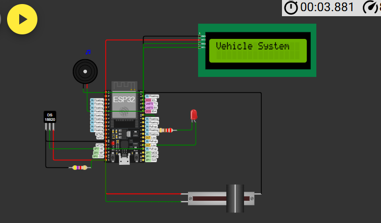

# SmartTrack: Intelligent Vehicle Tracking & Monitoring System

# 🚗 SmartTrack System for Vehicles

**SmartTrack** is an IoT-enabled vehicle diagnostics and GPS tracking system based on the ESP32 microcontroller. Unlike traditional trackers, this system provides **real-time health monitoring** alongside **location tracking**, enabling predictive maintenance, driver alerts, and operational efficiency for fleet managers and individual users.

---

## 📌 Features

- 🔧 **OBD-II Parameter Monitoring**: RPM, coolant temperature, battery voltage, and DTCs
- 🌍 **GPS Tracking**: Real-time location with SMS notifications
- 📟 **LCD Dashboard**: Visual feedback on vehicle health and location
- 📡 **Alerts**: SMS, LED, and buzzer alerts for overheating and low battery
- 📈 **Predictive Maintenance**: Using ML algorithms on historical data
- ☁️ **Cloud Integration**: ThingSpeak/Blynk dashboards for analytics and monitoring

---

## 🔧 Hardware Used

- ESP32-WROOM-32 (Microcontroller)
- DS18B20 (Temperature Sensor)
- Potentiometer (Battery voltage simulator)
- NEO-6M GPS Module
- SIM800L GSM Module
- 16x2 LCD (I2C)
- LED + Buzzer (Alerts)

---

## 🛠️ Software Used

- Arduino IDE (Programming)
- Wokwi Simulator (Testing)
- ThingSpeak / Blynk (Dashboard)
- Python (ML-based failure prediction)

---

## 🧪 Test Cases

| Component       | Test Condition             | Expected Behavior                             |
|----------------|----------------------------|-----------------------------------------------|
| DS18B20 Sensor | Temp > 40°C                 | Alert + DTC P0118                              |
| Potentiometer  | Voltage < 11.8V             | Alert + DTC P0562                              |
| GPS Module     | Valid/Invalid coordinates   | GPS data or "Signal Lost" alert via SMS        |
| GSM Module     | Overheat/Low Voltage        | Sends SMS alerts                              |
| LCD Display    | Normal & Alert conditions   | Displays RPM, Temp, Voltage & DTC messages     |
| LED/Buzzer     | DTC Present/Cleared         | ON during alert, OFF when resolved             |

---

## 🧠 Uniqueness

> Combines GPS tracking and real-time vehicle diagnostics into a **single IoT-based system** with predictive analytics, significantly reducing downtime and maintenance costs.

---

## 💡 One-liner Promotion

**"Drive smart, detect early — with SmartTrack!"**

---

## 🔁 Alternative Idea

A **mobile-only app** that connects via Bluetooth to a basic OBD-II scanner to display alerts and GPS location without cloud integration.

---

## 📽️ Demo

📺 [SmartTrack Simulation Video](https://drive.google.com/file/d/1EGpM_EBqUfFzOrm4RatJd8n04CFp6XBK/view?usp=sharing)  
📑 [Research Paper on Existing System](https://drive.google.com/file/d/1ONU0mmwE6Kd2LYBW2lxgsrP5XZON_szy/view?usp=sharing)

---

## 📂 GitHub Repo

🔗 https://github.com/EESHA-P/SmartTrack-system-for-vehicles

---

## 📈 Future Enhancements

- CAN bus integration for electric vehicles
- Driver behavior analysis with accelerometer
- AI-based failure prediction from sensor patterns

---
